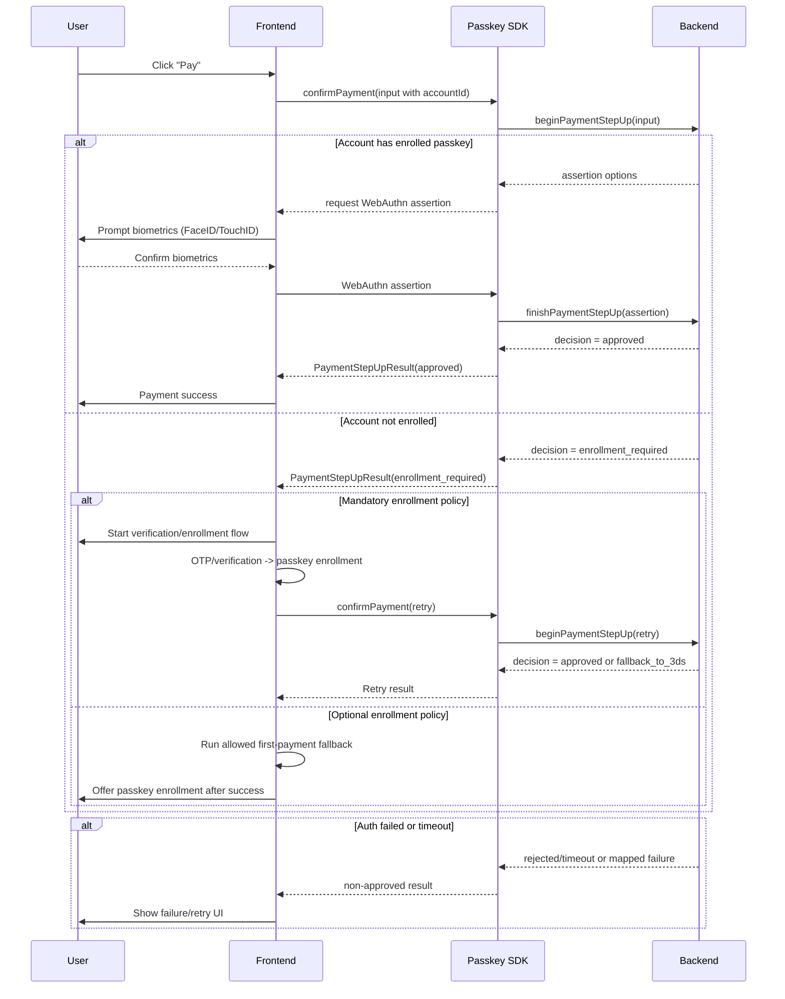
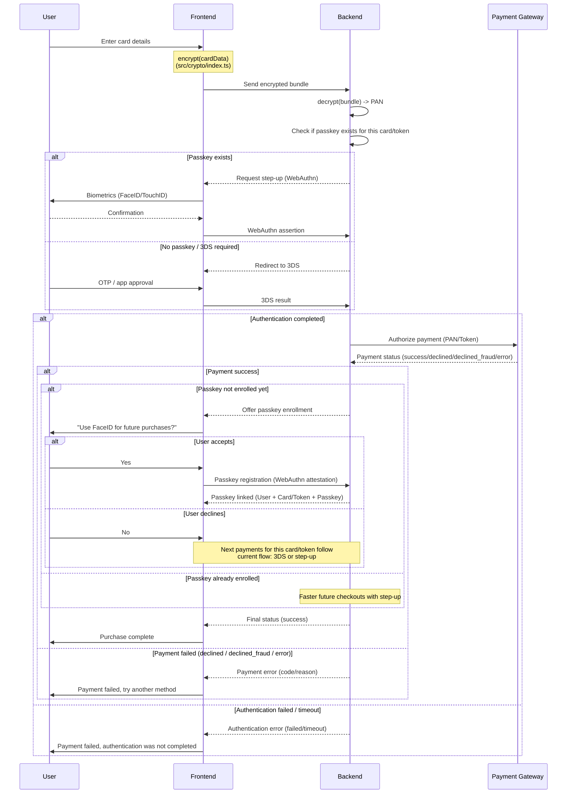
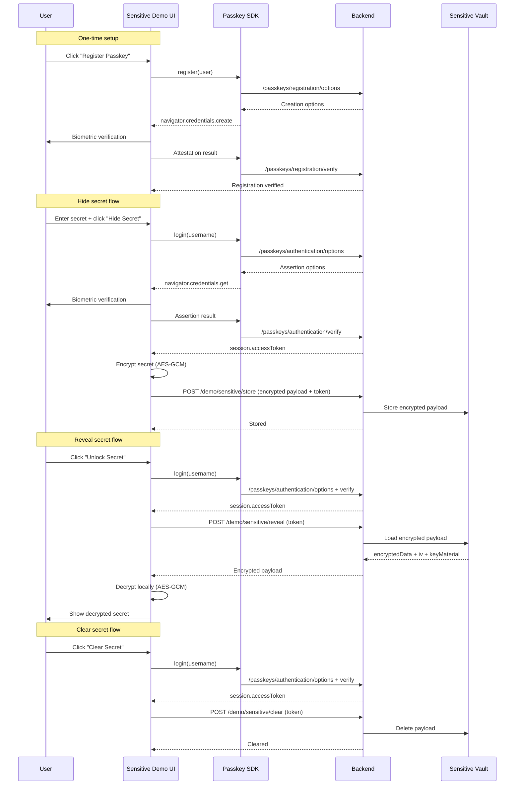

# @olton/passkey

Passkey SDK - is a library for web authentication using passkey features such as passwordless login, sensitive action confirmation, and payment step-up.

## Table of Contents

- [Platform authenticators](#platform-authenticators)
- [Documentation Index](#documentation-index)
- [Payment Integration Guides](#payment-integration-guides)
- [Payment Flow Diagrams](#payment-flow-diagrams)
- [Sensitive Vault Flow Diagram](#sensitive-vault-flow-diagram)
- [Key Benefits](#key-benefits)
- [Features](#features)
- [Installation](#installation)
- [Quick Start](#quick-start)
- [Client-Backend Integration (Without Demo Server)](#client-backend-integration-without-demo-server)
- [Module Exports](#module-exports)
- [Usage Examples](#usage-examples)
- [Run Demo Locally](#run-demo-locally)
- [Build Outputs](#build-outputs)
- [Scripts](#scripts)
- [Contributing](#contributing)
- [License](#license)
- [Support](#support)

## Platform authenticators:
- On Windows this library can be used with Windows Hello as a platform authenticator.
- On macOS and iOS, it can be used with Touch ID or Face ID as platform authenticators.
- On Android, it can be used with the built-in biometric authentication as a platform authenticator.
- On Linux, platform authenticator availability is highly variable, so the library is designed to work with roaming authenticators (security keys) and phone passkey flows as primary options.

Cross-platform reference matrix: [docs/platform-matrix.md](docs/platform-matrix.md).

Platform runbooks:

- Windows: [docs/windows-hello.md](docs/windows-hello.md)
- Android: [docs/android-demo.md](docs/android-demo.md)
- iOS: [docs/ios-demo.md](docs/ios-demo.md)
- Linux: [docs/linux-demo.md](docs/linux-demo.md)

## Documentation Index

- Platform matrix (capabilities by OS/browser): [docs/platform-matrix.md](docs/platform-matrix.md)
- API contract (request/response schema): [docs/api-contract.md](docs/api-contract.md)
- Demo runbook (end-to-end local demo flow): [docs/demo-runbook.md](docs/demo-runbook.md)
- Windows Hello setup: [docs/windows-hello.md](docs/windows-hello.md)
- Android setup: [docs/android-demo.md](docs/android-demo.md)
- iOS setup: [docs/ios-demo.md](docs/ios-demo.md)
- Linux setup: [docs/linux-demo.md](docs/linux-demo.md)

## Payment Integration Guides

- Account service integration: [src/payments/account-service-integration.md](src/payments/account-service-integration.md)
- Card service integration: [src/payments/card-service-integration.md](src/payments/card-service-integration.md)

## Payment Flow Diagrams

### Account service flow



### Card service flow



## Sensitive Vault Flow Diagram



## Key Benefits

The library helps you implement passkey-based `WebAuthn` flows for:

- passwordless login
- sensitive action confirmation
- payment step-up as an alternative to 3DS (with fallback)
- scenario-oriented orchestration for web clients

## Features

- typed WebAuthn DTOs for backend contracts
- browser WebAuthn transport service
- pluggable backend adapter
- high-level authentication and payment services
- a single facade client for integration
- generated TypeScript declaration files

## Installation

```bash
npm i @olton/passkey
```

## Quick Start

```ts
import {
	createFetchBackendAdapter,
	createPasskeyClient,
} from "@olton/passkey";

const adapter = createFetchBackendAdapter({
	baseUrl: "https://api.example.com",
});

const passkey = createPasskeyClient({ adapter });

await passkey.register({
	user: {
		id: "user_1",
		username: "demo@example.com",
		displayName: "Demo User",
	},
});

const loginResult = await passkey.login({
	username: "demo@example.com",
});
```

## Client-Backend Integration (Without Demo Server)

The SDK includes client-side orchestration only. You must provide your own backend API that returns WebAuthn options and verifies WebAuthn results.

Demo servers in this repository are reference implementations, not a required runtime dependency.

### SDK method -> backend calls

1. `passkey.register(input)`:
- `POST /passkeys/registration/options`
- `POST /passkeys/registration/verify`
2. `passkey.login(input)` and `passkey.confirmSensitiveAction(input)`:
- `POST /passkeys/authentication/options`
- `POST /passkeys/authentication/verify`
3. `passkey.confirmPayment(input)`:
- `POST /passkeys/payments/options`
- `POST /passkeys/payments/verify`

### Minimal setup checklist

1. Implement the 6 endpoints above in your backend.
2. Ensure each challenge is one-time and short-lived.
3. Verify origin, RP ID, signature, and counter server-side.
4. Point SDK adapter to your API URL.

```ts
import {
	createFetchBackendAdapter,
	createPasskeyClient,
} from "@olton/passkey";

const adapter = createFetchBackendAdapter({
	baseUrl: "https://api.your-domain.com",
});

const passkey = createPasskeyClient({ adapter });
```

If your routes differ, override endpoint paths explicitly:

```ts
const adapter = createFetchBackendAdapter({
	baseUrl: "https://api.your-domain.com",
	endpoints: {
		beginRegistration: "/v1/passkeys/register/options",
		finishRegistration: "/v1/passkeys/register/verify",
	},
});
```

All routes:
```ts
export const DEFAULT_PASSKEY_BACKEND_ENDPOINTS: Readonly<PasskeyBackendEndpoints> = {
  beginRegistration: "/passkeys/registration/options",
  finishRegistration: "/passkeys/registration/verify",
  beginAuthentication: "/passkeys/authentication/options",
  finishAuthentication: "/passkeys/authentication/verify",
  beginPaymentStepUp: "/passkeys/payments/options",
  finishPaymentStepUp: "/passkeys/payments/verify",
};
```

See full request/response schema in [docs/api-contract.md](docs/api-contract.md).

## Module Exports

Below is the full list of exports from `@olton/passkey`.

### Client Facade

Module docs: [src/core/readme.md](src/core/readme.md)

- `createPasskeyClient` - factory for creating `PasskeyClient`.
- `PasskeyClient` - main SDK facade for registration, login, step-up, and scenario flows.
- `PasskeyClientConfig` - facade configuration (backend adapter and optional WebAuthn service).

### Backend Adapter

Module docs: [src/adapters/readme.md](src/adapters/readme.md)

- `PasskeyBackendAdapter` - API adapter contract for registration/auth/payment flows.
- `PasskeyBackendEndpoints` - endpoint path set for the fetch adapter.
- `DEFAULT_PASSKEY_BACKEND_ENDPOINTS` - default endpoint map used by `createFetchBackendAdapter`.
- `FetchBackendAdapterConfig` - fetch adapter configuration (base URL, headers, endpoints).
- `createFetchBackendAdapter` - creates an adapter to integrate with your backend via `fetch`.

### Authentication and Payment Services

Module docs:

- [src/auth/readme.md](src/auth/readme.md)
- [src/payments/readme.md](src/payments/readme.md)
- [src/use-cases/readme.md](src/use-cases/readme.md)

- `PasskeyAuthService` - high-level service for registration and authentication.
- `PaymentStepUpService` - passkey step-up orchestration for account-level payment confirmation.
- `WebClientUseCases` - scenario-oriented orchestrator for web clients.

### Scenario Contracts (Use Cases)

Module docs: [src/use-cases/readme.md](src/use-cases/readme.md)

- `LoginUseCaseRequest` - payload for login scenario.
- `PaymentStepUpUseCaseRequest` - payload for payment step-up scenario.
- `SensitiveActionUseCaseRequest` - payload for sensitive action confirmation scenario.
- `PasswordlessRecoveryUseCaseRequest` - payload for passwordless recovery scenario.
- `WebClientUseCaseRequest` - union of all supported scenario requests.
- `WebClientUseCaseResponse` - unified response type for scenario orchestration.

### WebAuthn Transport

Module docs: [src/webauthn/readme.md](src/webauthn/readme.md)

- `WebAuthnService` - browser WebAuthn transport service (credential creation + assertion).

### SDK Errors

Module docs: [src/errors/readme.md](src/errors/readme.md)

- `PasskeyError` - base SDK error.
- `PasskeyNotSupportedError` - browser/runtime does not support WebAuthn.
- `UserCancelledError` - user cancelled passkey ceremony.
- `BackendAdapterError` - HTTP/contract errors from backend adapter interaction.

### Base64url Utilities

Module docs: [src/utils/readme.md](src/utils/readme.md)

- `base64UrlToArrayBuffer` - converts base64url to `ArrayBuffer`.
- `arrayBufferToBase64Url` - converts `ArrayBuffer` to base64url.
- `uint8ArrayToBase64Url` - converts `Uint8Array` to base64url.
- `base64UrlToUint8Array` - converts base64url to `Uint8Array`.

### Generic Crypto Utilities

Module docs: [src/crypto/readme.md](src/crypto/readme.md)

- `encrypt` - generic AES-GCM encrypt for JSON-serializable payloads.
- `decrypt` - generic AES-GCM decrypt for serialized payload bundles.
- `EncryptedPayloadBundle` - serialized encrypted payload bundle shape.

### Core Domain Types and Decisions

Module docs: [src/types/readme.md](src/types/readme.md)

- `Base64Url` - string in base64url format.
- `StepUpDecision` - payment step-up decision (`approved`, `fallback_to_3ds`, `rejected`, `enrollment_required`).
- `WebClientScenario` - supported web client business scenarios.

### User Profile, Risk Signals, and Payment Context

Module docs: [src/types/readme.md](src/types/readme.md)

- `PasskeyUser` - user data for passkey registration.
- `RiskSignals` - optional signals for fraud/risk analysis.
- `PaymentContext` - business context for payment confirmation.
- `CardPaymentContext` - deprecated alias for backward compatibility.

### WebAuthn JSON DTOs

Module docs: [src/types/readme.md](src/types/readme.md)

- `PublicKeyCredentialDescriptorJSON` - JSON representation of credential descriptor.
- `PublicKeyCredentialUserEntityJSON` - JSON representation of WebAuthn user entity.
- `PublicKeyCredentialCreationOptionsJSON` - JSON credential creation options (registration).
- `PublicKeyCredentialRequestOptionsJSON` - JSON assertion options (authentication/payment).
- `CredentialAttestationJSON` - serialized passkey registration result.
- `CredentialAssertionJSON` - serialized passkey authentication result.

### Backend Request Types

Module docs: [src/types/readme.md](src/types/readme.md)

- `BeginRegistrationInput` - payload to request registration options.
- `FinishRegistrationInput` - payload to verify registration.
- `BeginAuthenticationInput` - payload to request authentication options.
- `FinishAuthenticationInput` - payload to verify authentication.
- `BeginPaymentStepUpInput` - payload to request payment step-up options.
- `FinishPaymentStepUpInput` - payload to verify payment step-up.

### Verification Results and Session

Module docs: [src/types/readme.md](src/types/readme.md)

- `AuthSession` - session data after successful authentication.
- `RegistrationVerificationResult` - registration verification result.
- `AuthenticationVerificationResult` - authentication verification result.
- `PaymentStepUpVerificationResult` - backend payment step-up verification result.
- `PaymentStepUpResult` - final client step-up result (including fallback/3DS flags).

## Usage Examples

This section is written for beginners: follow the steps in order.

### What happens in real life

1. You initialize the SDK client.
2. You register a passkey one time per user/device.
3. Later, you call login/confirm/payment methods when needed.

### Step 1) Create the client (once)

Use this during app startup (for example when your page/app initializes).

```ts
import {
	createFetchBackendAdapter,
	createPasskeyClient,
} from "@olton/passkey";

const adapter = createFetchBackendAdapter({
	baseUrl: "http://localhost:4100", // replace with your backend URL
});

const passkey = createPasskeyClient({ adapter });
```

### Step 2) Register passkey (first time only)

Call this when user clicks a button like "Enable passkey".

```ts
const registration = await passkey.register({
	user: {
		id: "user_1",
		username: "demo@example.com",
		displayName: "Demo User",
	},
});

if (registration.verified) {
	console.log("Passkey registration successful");
}
```

Expected result:
1. Browser opens passkey prompt.
2. User confirms with Windows Hello / Face ID / Touch ID.
3. Backend verifies and stores credential.

### Step 3) Use passkey flows

After successful registration, use any of these methods.

#### A) Passwordless login

```ts
const loginResult = await passkey.login({
	username: "demo@example.com",
	context: {
		source: "web",
	},
});

if (loginResult.verified) {
	console.log("Login successful");
}
```

#### B) Sensitive action confirmation

```ts
const confirmResult = await passkey.confirmSensitiveAction({
	userId: "user_1",
	context: {
		action: "change-payout-account",
	},
});

if (confirmResult.verified) {
	console.log("Sensitive action confirmed");
}
```

#### C) Payment step-up

```ts
const paymentResult = await passkey.confirmPayment({
	payment: {
		paymentIntentId: "pi_100",
		amountMinor: 45000,
		currency: "UAH",
		merchantId: "merchant_1",
		accountId: "click2pay_account_1",
	},
	userId: "user_1",
});

if (paymentResult.decision === "fallback_to_3ds") {
	// your fallback path when passkey cannot approve payment
}

if (paymentResult.decision === "enrollment_required") {
	// run account verification (email/phone OTP) and passkey enrollment flow
}
```

Passkey enrollment for this flow should happen once per account (for example after OTP verification), then the same passkey is reused for all cards in that account.

#### D) Single entry-point (scenario mode)

Use this if you prefer one unified method instead of many separate methods.

```ts
const result = await passkey.runUseCase({
	scenario: "payment-step-up",
	input: {
		payment: {
			paymentIntentId: "pi_101",
			amountMinor: 1000,
			currency: "UAH",
			merchantId: "merchant_1",
		},
		userId: "user_1",
	},
});

console.log("Use-case result:", result);
```

### Common beginner mistakes

1. Calling `login()` before `register()` for a new user.
2. Using wrong `baseUrl` (frontend points to API that is not running).
3. Testing on unsupported origin (use `localhost` or HTTPS).
4. Forgetting backend verification endpoints.

## Run Demo Locally

### 1) Start One of the Demo Backends

#### Option A: Mock Backend (Quick Local Checks)

```bash
npm run server:mock
```

Default URL: `http://localhost:4000`

#### Option B: Dedicated WebAuthn Backend (Windows Hello)

```bash
npm run server:device
```

Default URL: `http://localhost:4100`

This server returns WebAuthn policies for platform authenticators (`authenticatorAttachment: "platform"`) and `userVerification: "required"`.

### 2) Start Demo UI

```bash
npm run dev
```

Open: `http://localhost:5173`

Dedicated login/password -> passkey onboarding demo: `http://localhost:5173/login.html`

Dedicated sensitive data vault demo with passkey access: `http://localhost:5173/sensitive.html`

### 3) Try Demo Scenarios

- Register passkey
- Login with passkey
- Confirm a sensitive action
- Confirm a payment with account-level passkey reuse

Tip: keep `Use mock WebAuthn transport` enabled for predictable local behavior.

For real platform authenticator tests, disable `Use mock WebAuthn transport` and set `API Base URL` to your reachable backend URL (for local machine tests, typically `http://localhost:4100`).

For complete local demo steps and troubleshooting, see [docs/demo-runbook.md](docs/demo-runbook.md).

Dedicated setup runbooks:

- Windows Hello: [docs/windows-hello.md](docs/windows-hello.md)
- Android: [docs/android-demo.md](docs/android-demo.md)
- iOS: [docs/ios-demo.md](docs/ios-demo.md)
- Linux: [docs/linux-demo.md](docs/linux-demo.md)

## Build Outputs

- ESM bundle: `dist/prod/passkey.es.js`
- CJS bundle: `dist/prod/passkey.cjs.js`
- Type declarations: `dist/types/index.d.ts`

## Scripts

- `npm run dev` - start demo UI
- `npm run server:mock` - start mock backend
- `npm run server:device` - start dedicated WebAuthn backend for Windows Hello
- `npm run start:mock` - start mock backend and demo UI together
- `npm run start:device` - start WebAuthn backend and demo UI together
- `npm run test` - run test suite
- `npm run build:prod` - build production bundles and declarations
- `npm run build` - lint + typecheck + test + production build
- `npm run lint` - run linter
- `npm run typecheck` - run TypeScript type checker

---

## Contributing

Contributions are welcome! Please open issues for bugs or feature requests, and submit pull requests for improvements.

## License
This project is licensed under the MIT License. See the [LICENSE](LICENSE) file for details.

## Support

If you like this project, please consider supporting it by:

+ Star this repository on GitHub
+ Sponsor this project on GitHub Sponsors
+ **PayPal** to `serhii@pimenov.com.ua`.
+ [**Patreon**](https://www.patreon.com/metroui)
+ [**Buy me a coffee**](https://buymeacoffee.com/pimenov)

---

Copyright (c) 2026 by [Serhii Pimenov](https://pimenov.com.ua). All Rights Reserved.
