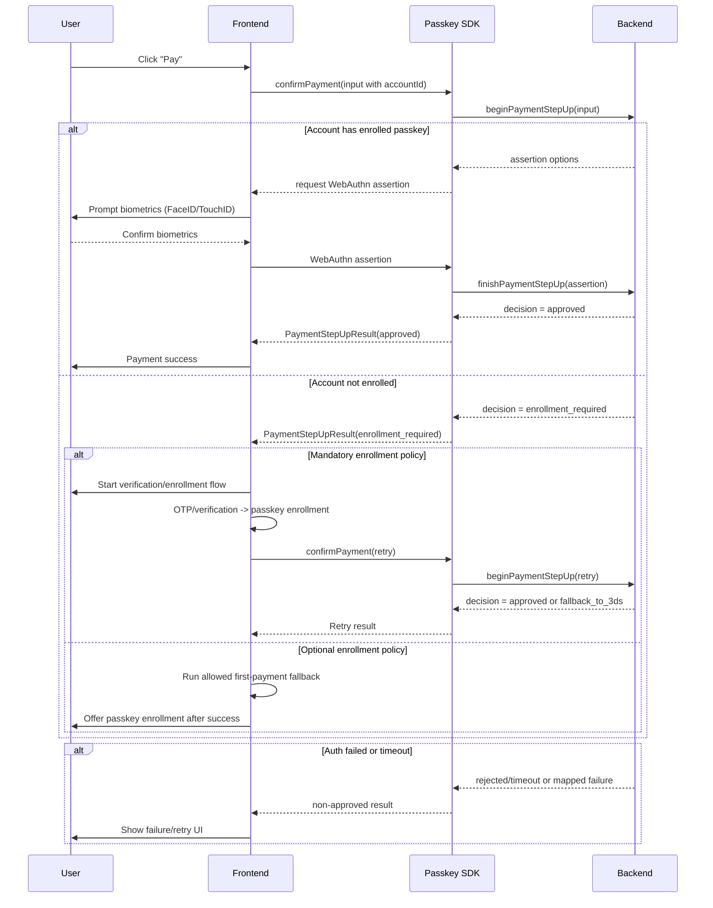

# Account Service Integration Guide

This guide explains how to integrate payment confirmation with passkeys in a simple way.

## 1. Main idea

You should treat passkey as an **account-level** factor.

- Do not create a passkey for each card.
- The passkey is tied to the payment account, not to a single card.
- In account-based payment flows, enrollment is typically completed around the first account payment journey (after account verification like phone/email + OTP).
- After that, reuse the same passkey for payments with any card inside this account.

## 2. What method to call

Use:

```ts
import { StepUpDecision } from "@olton/passkey";

await passkey.confirmPayment(input)
```

## 3. Minimal input

```ts
const result = await passkey.confirmPayment({
  payment: {
    paymentIntentId: "pi_100",
    amountMinor: 45000,
    currency: "UAH",
    merchantId: "merchant_1",
    accountId: "payment_account_1", // important for account-level model
  },
  userId: "user_1", // optional, but recommended
  context: {
    source: "checkout",
  },
  riskSignals: {
    trustedDevice: true,
  },
});
```

## 4. How to read result

The SDK returns `PaymentStepUpResult` with these important fields:

- `decision`
- `usedPasskey`
- `code` (optional machine-readable code)

Possible `decision` values:

1. `approved`

   - Meaning: payment was confirmed by passkey step-up.
   - Typical frontend action: continue success flow.

2. `fallback_to_3ds`

   - Meaning: passkey flow cannot approve this payment under current policy/risk context.
   - Typical frontend action: start 3DS challenge flow.

3. `enrollment_required`

   - Meaning: account-level payment passkey is not enrolled (or must be re-enrolled).
   - Typical frontend action: treat this as a backend policy signal for this payment. Run your configured recovery path (verification/enrollment/retry) or route to fallback according to policy.

4. `rejected`

   - Meaning: payment step-up was explicitly rejected by backend policy/verification.
   - Typical frontend action: stop payment flow and show failure/retry path according to business rules.

## 5. What to do in each branch

### A) Payment approved

Condition:

- `result.decision === StepUpDecision.Approved`

Action:

- Continue payment success flow.
- Show success UI.

### B) Fallback to 3DS

Condition:

- `result.decision === StepUpDecision.FallbackTo3DS`

Action:

- Start your 3DS challenge flow.
- After 3DS result, continue your standard payment handling.

### C) Passkey enrollment required

Condition:

- `result.decision === StepUpDecision.EnrollmentRequired`

Action:

1. Interpret this as: backend currently requires enrollment for this payment path.
2. Run the branch your product policy allows:

- Mandatory policy: verification -> enrollment -> retry.
- Optional policy: route first payment via allowed non-passkey path, then offer enrollment after success.

### D) Recommended policy modes

1. Optional enrollment (your described model)

- First payment can succeed without mandatory passkey enrollment.
- After first successful transaction, show a non-blocking offer to enable passkey for faster/safer next payments.
- In this mode, backend should usually return `approved` or `fallback_to_3ds` for first payment instead of `enrollment_required`.

2. Mandatory enrollment (strict mode)

- Backend may return `enrollment_required` and block passkey payment path until enrollment is completed.

## 6. Ready-to-copy frontend handler

```ts
import { StepUpDecision } from "@olton/passkey";

async function confirmCheckoutPayment() {
  const result = await passkey.confirmPayment({
    payment: {
      paymentIntentId: "pi_100",
      amountMinor: 45000,
      currency: "UAH",
      merchantId: "merchant_1",
      accountId: "payment_account_1",
    },
    userId: "user_1",
  });

  if (result.decision === StepUpDecision.EnrollmentRequired) {
    // Backend requires enrollment for this payment path.
    // Choose one branch based on product policy.

    if (isMandatoryEnrollmentPolicy()) {
      await runOtpAndPasskeyEnrollment();
      return confirmCheckoutPayment();
    }

    // Optional policy: do NOT force enrollment now.
    // Route current payment by fallback policy and offer enrollment later.
    await runAllowedFirstPaymentFallback();
    return offerPasskeyEnrollmentAfterSuccessfulPayment();
  }

  if (result.decision === StepUpDecision.FallbackTo3DS) {
    return run3DSChallenge();
  }

  if (result.decision === StepUpDecision.Approved) {
    // Optional policy recommendation:
    // after first successful payment, show "Enable passkey" suggestion.
    maybeOfferPasskeyEnrollment();
    return handlePaymentSuccess(result);
  }

  return handlePaymentFailure(result);
}
```

## 7. Typical mistakes (and how to avoid)

1. Mistake: Creating passkey for each card.

- Fix: Create passkey per account and reuse it.

2. Mistake: Ignoring `decision === StepUpDecision.EnrollmentRequired`.

- Fix: Always handle this branch, but route by your policy (mandatory vs optional), not by hardcoded forced enrollment.

3. Mistake: Sending payment without `accountId`.
   
- Fix: Send `accountId` whenever available; it helps backend apply correct account policy.

4. Mistake: Treating all non-approved results as 3DS.
   
- Fix: First check `decision === StepUpDecision.EnrollmentRequired`, then `decision === StepUpDecision.FallbackTo3DS`.

## 8. Demo testing tip

You can test enrollment-required branch in local demo by using account IDs that start with:

- `unenrolled_`

Example:

- `unenrolled_payment_account_demo`

This is implemented in demo backends for predictable testing.

## 9. Flow diagram (call chain)

High-level call chain:

```
Frontend UI
  -> passkey.confirmPayment(input)
    -> AccountService.confirmPayment(input)
      -> adapter.beginPaymentStepUp(input)
      -> WebAuthn assertion (navigator.credentials.get)
      -> adapter.finishPaymentStepUp(credential)
      -> PaymentStepUpResult
```

Decision branch:

```
PaymentStepUpResult
  |
  +-- decision = enrollment_required
  |     -> mandatory policy: verification -> enrollment -> retry
  |     -> optional policy: first payment fallback -> offer enrollment after success
  |
  +-- decision = fallback_to_3ds
  |     -> run 3DS challenge
  |     -> continue payment flow
  |
  +-- decision = approved
        -> show payment success
```

Backend error mapping note:

- If backend returns credential_not_found or requiresReRegistration,
  SDK maps it to enrollment_required.

Account-payment nuance:

- Enrollment is not just "after OTP" in isolation.
- In many real integrations, OTP/account verification is part of the first payment lifecycle, and passkey enrollment is finalized in that lifecycle for the account.
- Frontend should not force enrollment unconditionally: it should execute the branch allowed by backend/product policy.

## 10. Detailed Account-Level Payment Flow

This section adds a practical end-to-end flow for account-level step-up.

### A) Enrolled account (passkey already linked)

Flow summary:

1. User clicks Pay.
2. Frontend calls `passkey.confirmPayment(...)` with `accountId`.
3. Backend returns WebAuthn assertion options.
4. Frontend runs biometrics (`navigator.credentials.get`).
5. Frontend sends assertion to backend verification endpoint.
6. Backend returns `approved`.
7. Frontend continues normal payment success path.

Important note:

- If user cancels biometrics or ceremony times out, treat it as authentication-not-completed and route to failure/retry UX.

### B) Unenrolled account (first-payment lifecycle)

Flow summary:

1. User clicks Pay.
2. Frontend calls `passkey.confirmPayment(...)` with `accountId`.
3. Backend detects missing account passkey and returns `enrollment_required`.
4. Frontend executes policy branch:

- Mandatory policy: verification -> enrollment -> retry payment.
- Optional policy: allow configured fallback path for current payment, then offer enrollment after success.

5. Final payment handling proceeds according to chosen policy branch.

## 11. Mermaid Visualization (English)



## 12. Branch Handling Matrix

Recommended frontend behavior:

1. `approved`

- Continue success flow.

2. `fallback_to_3ds`

- Start 3DS challenge and continue standard post-3DS handling.

3. `enrollment_required`

- Route by product policy (mandatory vs optional).

4. `rejected`

- Stop current payment path and show retry/alternative method.

## 13. Implementation Checklist

1. Always send `accountId` for account-level policy evaluation.
2. Keep explicit handling for `enrollment_required` (never treat as generic 3DS fallback).
3. Log cancellation/timeout separately from backend decline for analytics quality.
4. Preserve isolation from card-service flow (account policy remains account-scoped).

## 14. Isolated Architecture (Account Service)

This scenario is account-scoped and should remain independent from card-service behavior.

Isolation principles:

1. Keep account step-up orchestration in `AccountService`.
2. Treat passkey as an account-level factor, not an instrument-level factor.
3. Preserve policy-based branching (`approved`, `fallback_to_3ds`, `enrollment_required`, `rejected`).
4. Keep frontend logic policy-driven (mandatory vs optional enrollment).
5. Do not mix card/token gateway result semantics into account decision semantics.

Recommended account-level backend namespace:

1. `POST /passkeys/payments/options`
2. `POST /passkeys/payments/verify`

## 15. Implementation Plan (Rollout)

### Phase 1: Contract and policy alignment

1. Validate account-level decision contract with backend.
2. Ensure `enrollment_required` policy is explicit for all merchants/tenants.
3. Keep a stable mapping for backend credential errors to enrollment-required branch.

Done criteria:

- No ambiguity between enrollment and fallback branches.

### Phase 2: Frontend branch handling hardening

1. Implement deterministic branching for all decisions.
2. Keep mandatory and optional enrollment paths configurable.
3. Add timeout/cancel UX handling for retry and fallback.

Done criteria:

- Checkout behavior is predictable for all decision values.

### Phase 3: SDK and integration verification

1. Verify `passkey.confirmPayment(...)` usage across frontend surfaces.
2. Verify account context propagation (`accountId`, `merchantId`, payment intent).
3. Validate call-chain telemetry (begin, assertion, verify, decision).

Done criteria:

- Integration is stable across web/mobile wrappers where applicable.

### Phase 4: Demo and QA coverage

1. Validate `unenrolled_` demo branch for enrollment-required behavior.
2. Validate approved and fallback-to-3DS flows.
3. Validate rejected and timeout/cancel UX outputs.

Done criteria:

- All major branches are reproducible in demo and test environments.

### Phase 5: Regression safety

1. Keep account-service tests green.
2. Ensure card-service integration stays unaffected.
3. Keep API behavior backward-compatible for existing account clients.

Done criteria:

- No regressions in account-service behavior.

## 16. Acceptance Criteria and Risks

Acceptance criteria:

1. Account flow always evaluates and returns an explicit decision.
2. `enrollment_required` branch is handled by product policy without hardcoded forced enrollment.
3. `fallback_to_3ds` is routed to 3DS flow only when applicable.
4. Timeout/cancel UX is distinct from explicit backend rejection.
5. Account-service flow remains isolated from card-service result semantics.

Main risks and mitigations:

1. Hardcoding one policy mode in frontend.

- Mitigation: keep mandatory vs optional policy selectable via product configuration.

2. Misclassification of failure reasons.

- Mitigation: separate analytics for `rejected`, timeout/cancel, and fallback-to-3DS paths.

3. Cross-flow coupling with card-service.

- Mitigation: maintain separate services, contracts, and test suites.
