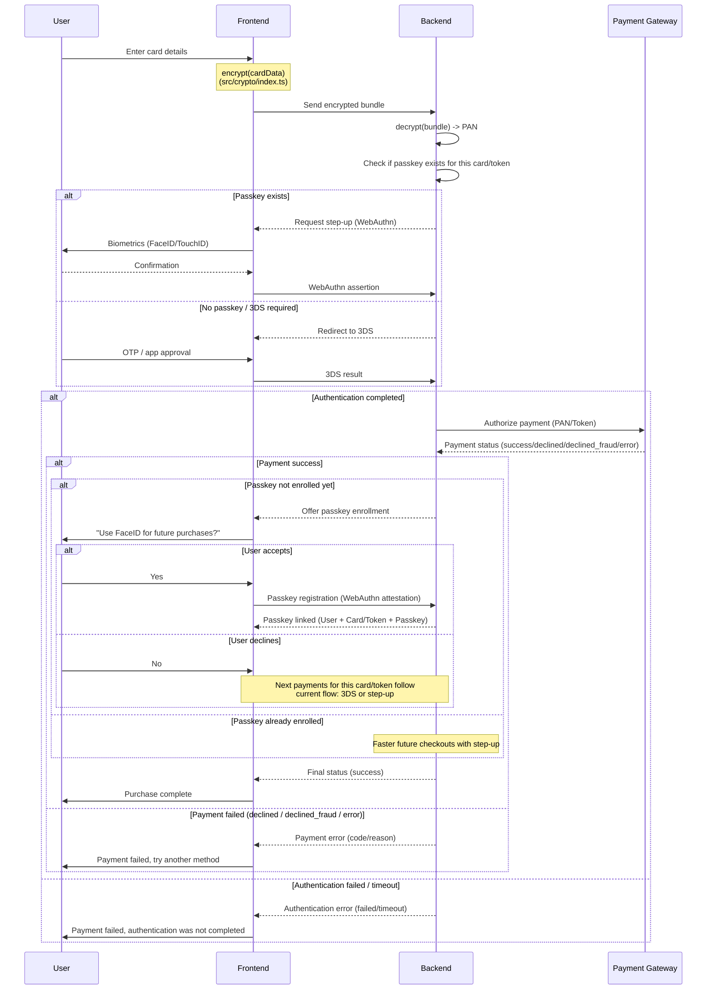

# Card Service Integration Guide

This guide explains how to integrate card/token checkout with passkeys in a simple and practical way.

## 1. Main idea

Use card service when you need a card-focused flow (new card or tokenized card), separate from account-level passkey flow.

- You can process checkout for either:
  - a new card (card fingerprint branch)
  - a tokenized card (token branch)
- Passkey step-up is executed before final payment authorization.
- Final payment status is returned separately from auth decision.
- After successful payment, you can optionally enroll passkey for faster next payments.

## 2. What methods to call

Use:

```ts
await passkey.confirmCardCheckout(input)
```

Optionally (after successful checkout):

```ts
await passkey.enrollCardPasskey(input)
```

## 3. Minimal input for card checkout

```ts
const checkout = await passkey.confirmCardCheckout({
  payment: {
    paymentIntentId: "pi_card_100",
    amountMinor: 2500,
    currency: "UAH",
    merchantId: "merchant_1",
  },
  instrument: {
    type: "token", // "token" | "card"
    tokenId: "tok_123",
  },
  userId: "user_1",
  passkeyAlreadyBound: false,
  context: {
    source: "checkout",
  },
  riskSignals: {
    trustedDevice: true,
  },
});
```

If `instrument.type === "card"`, provide `cardFingerprint` instead of `tokenId`.

## 4. How to read checkout result

The SDK returns `CardTokenCheckoutResult` with key fields:

- `authDecision`
- `gatewayStatus`
- `usedPasskey`
- `shouldOfferEnrollment`
- `code` (optional)

### `authDecision` values

1. `approved`

- Meaning: passkey step-up is successful.
- Next step: inspect `gatewayStatus`.

2. `fallback_to_3ds`

- Meaning: this payment should go through 3DS path.
- Next step: start 3DS flow.

3. `rejected`

- Meaning: step-up was rejected by policy/verification.
- Next step: stop checkout and show failure path.

4. `timeout`

- Meaning: authentication was not completed in time.
- Next step: show retry path.

5. `cancelled`

- Meaning: user cancelled passkey ceremony.
- Next step: show retry or fallback path.

6. `not_supported`

- Meaning: browser/runtime does not support passkeys for this flow.
- Next step: fallback path (typically 3DS).

7. `error`

- Meaning: unexpected auth-side error.
- Next step: show generic error and retry option.

### `gatewayStatus` values

`gatewayStatus` is meaningful when `authDecision === "approved"`.

1. `success`

- Meaning: payment authorized successfully.
- Next step: complete purchase.

2. `declined`

- Meaning: payment declined by issuer/processor.
- Next step: show decline and allow retry/another method.

3. `declined_fraud`

- Meaning: blocked by fraud policy.
- Next step: show security-oriented failure message.

4. `error`

- Meaning: processing error on gateway path.
- Next step: retry or fallback method.

## 5. Optional enrollment step

After successful checkout, when `shouldOfferEnrollment === true`, you can ask user to bind passkey for this card/token.

Example:

```ts
const enrollment = await passkey.enrollCardPasskey({
  payment: {
    paymentIntentId: "pi_card_100",
    amountMinor: 2500,
    currency: "UAH",
    merchantId: "merchant_1",
  },
  instrument: {
    type: "token",
    tokenId: "tok_123",
  },
  user: {
    id: "user_1",
    username: "demo@example.com",
    displayName: "Demo User",
  },
});
```

Enrollment result (`CardTokenEnrollmentResult`):

- `bound` - passkey is linked successfully.
- `skipped_by_user` - user cancelled/skipped.
- `failed` - enrollment failed.

## 6. Ready-to-copy frontend handler

```ts
async function confirmCardFlow() {
  const result = await passkey.confirmCardCheckout({
    payment: {
      paymentIntentId: "pi_card_100",
      amountMinor: 2500,
      currency: "UAH",
      merchantId: "merchant_1",
    },
    instrument: {
      type: "token",
      tokenId: "tok_123",
    },
    userId: "user_1",
    passkeyAlreadyBound: false,
  });

  if (result.authDecision !== "approved") {
    return handleAuthBranch(result.authDecision);
  }

  if (result.gatewayStatus !== "success") {
    return handleGatewayBranch(result.gatewayStatus);
  }

  if (result.shouldOfferEnrollment) {
    const accepted = await askUserToEnrollPasskey();

    if (accepted) {
      await passkey.enrollCardPasskey({
        payment: {
          paymentIntentId: "pi_card_100",
          amountMinor: 2500,
          currency: "UAH",
          merchantId: "merchant_1",
        },
        instrument: {
          type: "token",
          tokenId: "tok_123",
        },
        user: {
          id: "user_1",
          username: "demo@example.com",
          displayName: "Demo User",
        },
      });
    }
  }

  return handlePaymentSuccess();
}
```

## 7. Typical mistakes (and how to avoid)

1. Mistake: Mixing auth and payment outcomes.

- Fix: First read `authDecision`, then read `gatewayStatus`.

2. Mistake: Not validating instrument fields.

- Fix: For `token`, require `tokenId`; for `card`, require `cardFingerprint`.

3. Mistake: Treating all non-success as one generic failure.

- Fix: Handle at least `fallback_to_3ds`, `declined`, `declined_fraud`, and `timeout` separately.

4. Mistake: Forcing enrollment after every payment.

- Fix: Offer enrollment only when `shouldOfferEnrollment === true` and keep it optional.

## 8. Demo testing tip

Use card-service demo page:

- `http://localhost:5173/card-service/index.html`

Try both branches:

- New card mode -> generate token/fingerprint
- Tokenized card mode -> direct checkout

Then validate optional enrollment branch after successful checkout.

## 9. Flow diagram (call chain)

High-level call chain:

```
Frontend UI
  -> passkey.confirmCardCheckout(input)
    -> CardService.confirm(input)
      -> adapter.beginCardTokenStepUp(input)
      -> WebAuthn assertion (navigator.credentials.get)
      -> adapter.finishCardTokenStepUp(credential)
      -> adapter.authorizeCardTokenPayment(...)
      -> CardTokenCheckoutResult
```

Optional enrollment chain:

```
Frontend UI
  -> passkey.enrollCardPasskey(input)
    -> CardService.enroll(input)
      -> adapter.beginCardTokenEnrollment(input)
      -> WebAuthn attestation (navigator.credentials.create)
      -> adapter.finishCardTokenEnrollment(credential)
      -> CardTokenEnrollmentResult
```

Important nuance:

- Card service flow is isolated and additive.
- It does not change behavior of account-service integration.

## 10. Detailed Card/Token Payment Flow

The flow below can be used for any payment type that supports card rails, including one-time payments and subscriptions.

### A) New user or non-tokenized card

Flow summary:

1. User enters card details.
2. Card data is encrypted and sent to backend as `EncryptedPayloadBundle`.
3. Backend checks if transaction can proceed.
4. If payment is allowed, run 3DS or passkey step-up (depending on passkey availability).
5. If authentication succeeds, backend executes transaction.
6. Backend can create/store card token for future payments.
7. If payment succeeds and passkey is not registered for this card/token, offer optional passkey enrollment.
8. If payment fails, show error and stop checkout.
9. User completes purchase.

Important note:

- Handle timeout explicitly for both 3DS and step-up. User may abandon ceremony before completion.

### B) Tokenized card

Flow summary:

1. User selects tokenized card.
2. System checks if token is already linked to passkey.
3. If linked, run passkey step-up.
4. If not linked, run 3DS (when required).
5. If authentication succeeds, backend executes transaction.
6. If payment succeeds and passkey is not registered for this card/token, offer optional passkey enrollment.
7. If authentication fails or times out, show error and stop checkout.
8. User completes purchase.

## 11. Mermaid Visualization (English)



## 12. Isolated Architecture (Card Service)

This scenario must stay isolated and must not alter account-service behavior.

Isolation principles:

1. Do not change behavior of existing `confirmPayment` account-level path.
2. Keep card/token orchestration in separate module/service.
3. Use dedicated backend contracts for card/token flow.
4. Enable by feature flag (merchant/tenant scoped).
5. If feature is off, all traffic uses existing account-level flow unchanged.

Target model:

- AuthDecision: pre-authorization auth result (`approved`, `fallback_to_3ds`, `rejected`, `timeout`, `cancelled`).
- GatewayStatus: final authorization result (`success`, `declined`, `declined_fraud`, `error`).
- EnrollmentOutcome: post-payment enrollment action (`bound`, `skipped_by_user`, `failed`).

Instrument context:

- `PaymentInstrumentRef.type`: `card` | `token`
- `PaymentInstrumentRef.cardFingerprint`: required for `card`
- `PaymentInstrumentRef.tokenId`: required for `token`

Recommended dedicated backend namespace:

1. `POST /passkeys/card-payments/options`
2. `POST /passkeys/card-payments/verify`
3. `POST /passkeys/card-payments/authorize`
4. `POST /passkeys/card-payments/passkey/enroll/options`
5. `POST /passkeys/card-payments/passkey/enroll/verify`

## 13. Implementation Plan (Rollout)

### Phase 1: Types and contracts

1. Add card/token domain types in `src/types/index.ts`.
2. Extend `src/adapters/index.ts` with card/token adapter contract.
3. Document card/token backend contract in `docs/api-contract.md`.

Done criteria:

- Existing behavior remains unchanged.
- Existing tests still pass.

### Phase 2: Isolated orchestration service

1. Implement `CardService` in `src/payments/card-service.ts`.
2. Implement auth options -> assertion -> verify -> authorize path.
3. Normalize timeout/cancel into stable typed outcomes.

Done criteria:

- No account-level policy leakage into card-service runtime path.

### Phase 3: SDK integration

1. Wire `cardPayments` branch in `src/core/index.ts`.
2. Add dedicated use-case scenario in `src/use-cases/index.ts`.
3. Export all required API from `src/index.ts`.

Done criteria:

- Existing scenarios are unaffected.
- New scenario is independently consumable.

### Phase 4: Demo and mock backend

1. Add card/token endpoints in mock/device servers.
2. Simulate `declined`, `declined_fraud`, and `error` branches.
3. Provide one dedicated demo page for card-service flow.

Done criteria:

- All branches from Mermaid diagram are reproducible manually.

### Phase 5: Tests and release readiness

1. Add unit coverage for card service.
2. Extend adapter tests.
3. Extend use-case tests.
4. Keep regression guarantees for account-service tests.

Done criteria:

- Green test suite.
- No regressions in account-service integration.

## 14. Acceptance Criteria and Risks

Acceptance criteria:

1. Feature flag off -> behavior is identical to current account-service implementation.
2. Feature flag on -> card/token flow returns dedicated typed result.
3. `declined`, `declined_fraud`, `error` statuses are explicit in UI handling.
4. User declining enrollment does not break next payments.
5. Timeout/cancel are not misreported as gateway failures.

Main risks and mitigations:

1. Mixing account-level and card/token-level logic.

- Mitigation: keep separate module, separate types, separate endpoint namespace.

2. Opaque timeout/cancel behavior.

- Mitigation: explicit enum-based auth outcomes.

3. Regression in existing integrations.

- Mitigation: strict backward compatibility gates + regression tests.
